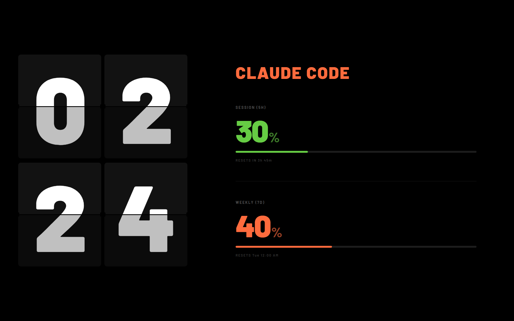
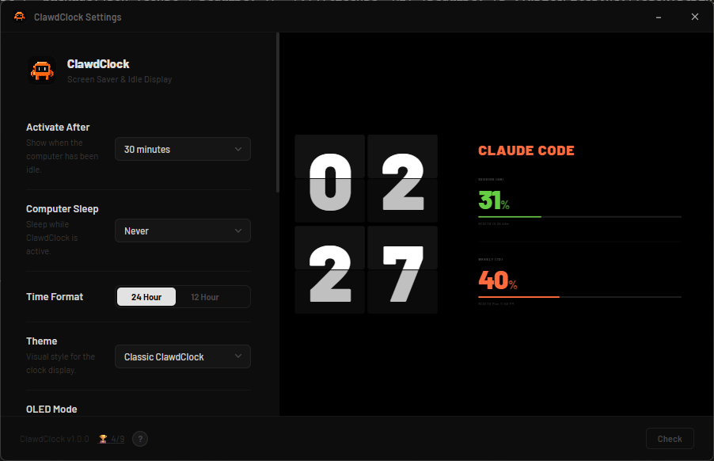

<div align="center">

```
   ██████╗██╗      █████╗ ██╗    ██╗██████╗      ██████╗██╗      ██████╗  ██████╗██╗  ██╗
  ██╔════╝██║     ██╔══██╗██║    ██║██╔══██╗    ██╔════╝██║     ██╔═══██╗██╔════╝██║ ██╔╝
  ██║     ██║     ███████║██║ █╗ ██║██║  ██║    ██║     ██║     ██║   ██║██║     █████╔╝
  ██║     ██║     ██╔══██║██║███╗██║██║  ██║    ██║     ██║     ██║   ██║██║     ██╔═██╗
  ╚██████╗███████╗██║  ██║╚███╔███╔╝██████╔╝    ╚██████╗███████╗╚██████╔╝╚██████╗██║  ██╗
   ╚═════╝╚══════╝╚═╝  ╚═╝ ╚══╝╚══╝ ╚═════╝      ╚═════╝╚══════╝ ╚═════╝  ╚═════╝╚═╝  ╚═╝
```

### A flip-clock screensaver that shows your Claude Code usage

*Ambient display · Windows screensaver · Live token tracking*

[](https://github.com/Piya-Boy/ClawdClock/releases/latest)
[](https://github.com/Piya-Boy/ClawdClock/releases)
[](https://tauri.app)
[](https://react.dev)
[](#license)

[**Download**](https://github.com/Piya-Boy/ClawdClock/releases/latest) ·
[**Features**](#-features) ·
[**Setup**](#-getting-started) ·
[**Build**](#-building-from-source)

</div>

---

## What is ClawdClock?

ClawdClock turns your idle screen into a giant flip clock that also tracks your **Claude Code** token usage in real time. When your computer sits idle it slides in, showing the time alongside your 5-hour session and 7-day weekly limits — so you always know how much headroom you have left before a reset.

It runs as a normal app, a system-tray resident, **and** a registered Windows screensaver (`.scr`).

<div align="center">



*The full-screen display — flip clock on the left, live Claude Code usage on the right*

</div>

---

## ✨ Features

| | |
|---|---|
| 🕐 **Flip clock** | Smooth folding-card animation, 24h / 12h formats |
| 📊 **Live usage** | Reads your Claude OAuth token, polls session (5h) + weekly (7d) limits |
| 🎨 **9 themes** | Classic, OLED Black, Fliqlo, Terminal Green, Retro Amber, + 4 seasonal |
| 💤 **Idle activation** | Appears after a configurable idle timeout (1 min – 2 hr) |
| 🖥️ **Windows screensaver** | Installs as a real `.scr` — pick it in Screen Saver Settings |
| 🔒 **Lock screen mode** | Blocks accidental mouse/keyboard dismiss while active |
| ⊗ **Escape button** | Hover the top edge → a round X slides down; click or `Esc` to exit |
| 🌑 **OLED mode** | Slowly shifts pixels to prevent burn-in |
| 🖥️ **Multi-monitor** | Show on one display or all at once |
| ⌨️ **Global hotkey** | Toggle the clock from anywhere (default `Ctrl+Shift+L`) |
| 🔄 **Auto-update** | Signed updater with one-click install and rollback |
| 🏆 **Achievements** | Little unlockables for usage milestones |

> **Privacy:** Your Claude credentials are read locally from `~/.claude/.credentials.json` and used only to call the usage API. Tokens are **never** displayed, logged, or transmitted anywhere except Anthropic's own endpoint.

---

## 🚀 Getting Started

### Install

1. Grab the latest installer from [**Releases**](https://github.com/Piya-Boy/ClawdClock/releases/latest):
   - **`ClawdClock_x.y.z_x64-setup.exe`** — recommended (NSIS, smaller)
   - **`ClawdClock_x.y.z_x64_en-US.msi`** — MSI alternative
   - **`ClawdClock_x.y.z_x64.scr`** — standalone screensaver file
2. Run the installer.
3. Make sure you're logged into Claude Code (`claude` CLI) so `~/.claude/.credentials.json` exists.

### First run

1. Open ClawdClock — the settings window appears, and an icon lands in your system tray.
2. Set **Activate After** to your preferred idle timeout.
3. Hit **Preview Now** to see the clock full-screen.
4. (Optional) Enable **Launch at Startup**.

<div align="center">



*Settings window with a live preview that updates as you tweak options*

</div>

### Exiting the clock

Move your mouse to the **very top of the screen** — a round **⊗** button slides down. Click it or press **`Esc`** to dismiss. With **Lock Screen Mode** on, only this button/`Esc` works (random mouse moves won't dismiss it).

---

## 🛠️ Tech Stack

```
┌──────────────────────── Frontend (WebView) ────────────────────────┐
│                                                                     │
│   React 19  ·  TypeScript  ·  Vite  ·  Zustand (persisted store)    │
│                                                                     │
│   ┌─────────────┐         ┌──────────────┐                          │
│   │  clock win  │◀───────▶│ settings win │   cross-window sync      │
│   │   (App)     │  Tauri  │ (SettingsApp)│   via Tauri events       │
│   └─────────────┘  events └──────────────┘                          │
└──────────────────────────────┬──────────────────────────────────────┘
                                │ invoke() / IPC
┌──────────────────────────────▼──────────────────────────────────────┐
│                       Backend (Rust · Tauri 2)                        │
│                                                                       │
│   reqwest ─ Claude usage API      dirs ─ ~/.claude/.credentials.json  │
│   windows-sys ─ idle detection, screensaver, monitors                 │
│   plugin-updater ─ signed auto-update     global-shortcut ─ hotkey    │
└───────────────────────────────────────────────────────────────────────┘
```

---

## 📁 Project Structure

```
ClawdClock/
├── src/                          # React frontend
│   ├── App.tsx                   # Clock window root
│   ├── SettingsApp.tsx           # Settings window root
│   ├── main.tsx                  # Picks root by window label
│   ├── components/
│   │   ├── FlipClock/            # Flip-card clock + digits
│   │   ├── ClawdClockView/       # Full 1920×1080 layout
│   │   ├── UsagePanel/           # Session / weekly bars
│   │   ├── EscapeBar/            # Hover-top exit button
│   │   ├── Settings/             # Settings UI panels
│   │   └── Achievements/         # Toast + panel
│   ├── hooks/                    # useClock, useClaudeUsage, useIdleDetection, …
│   ├── stores/                   # Zustand: settings + usage
│   ├── themes/                   # 9 theme definitions
│   └── services/                 # ClaudeUsageService
├── src-tauri/                    # Rust backend
│   ├── src/lib.rs                # Commands, tray, updater, screensaver
│   ├── capabilities/             # Tauri permission scopes
│   └── tauri.conf.json           # Windows, bundle, updater config
├── build-scr.ps1                 # Packages the .exe into a .scr
└── .github/workflows/release.yml # Tag-triggered CI release
```

---

## 🧑‍💻 Building from Source

### Prerequisites

- [Node.js](https://nodejs.org) 20+
- [Rust](https://rustup.rs) (stable)
- Windows + the [Tauri prerequisites](https://tauri.app/start/prerequisites/) (WebView2, MSVC build tools)

### Develop

```bash
npm install
npm run tauri dev
```

### Build a release binary

```bash
npm run tauri build      # → .exe (NSIS) + .msi in src-tauri/target/release/bundle/
npm run build:scr        # → ClawdClock_x.y.z_x64.scr
```

### Signing (for auto-update)

Updater artifacts need a signature. Provide the key via env before building:

```powershell
$env:TAURI_SIGNING_PRIVATE_KEY = Get-Content "$HOME\.tauri\your-signing.key" -Raw
$env:TAURI_SIGNING_PRIVATE_KEY_PASSWORD = "<key password>"
npm run tauri build
```

This emits a `.sig` next to each installer. The public key lives in `src-tauri/tauri.conf.json` under `plugins.updater.pubkey`.

---

## 🎨 Themes

| Theme | Vibe |
|---|---|
| **Classic ClawdClock** | Default warm-orange flip clock |
| **OLED Black** | Pure black, minimal — pairs with OLED mode |
| **Fliqlo Classic** | The iconic dark flip-clock look |
| **Terminal Green** | Phosphor CRT green |
| **Retro Amber** | Vintage amber monochrome |
| **Spring Blossom** · **Summer Neon** · **Autumn Ember** · **Winter Ice** | Seasonal palettes |

Change it in **Settings → Theme** — the live clock updates instantly across windows.

---

## 🔄 Releasing

Tag-triggered (when GitHub Actions billing is active):

```bash
# bump version in package.json, src-tauri/tauri.conf.json, src-tauri/Cargo.toml
git tag vX.Y.Z
git push origin vX.Y.Z      # → .github/workflows/release.yml builds + drafts the release
```

The workflow builds the Windows bundle, signs it, generates `latest.json` for the updater, packages the `.scr`, and attaches everything to a draft release.

---

## License

MIT © [Piya-Boy](https://github.com/Piya-Boy)

<div align="center">

---

*Made for people who stare at the clock waiting for their tokens to reset.*

</div>
